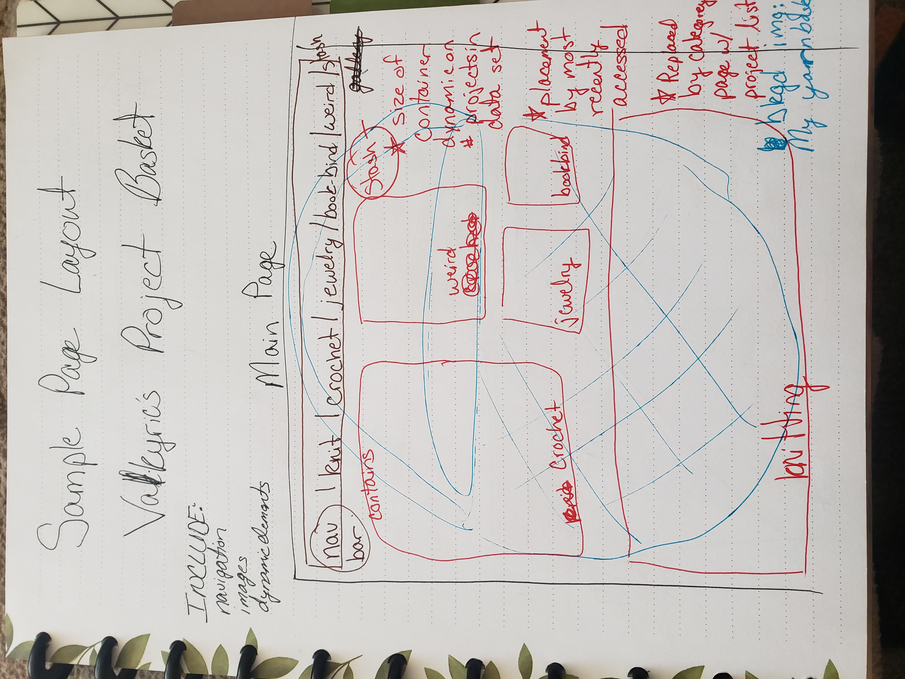
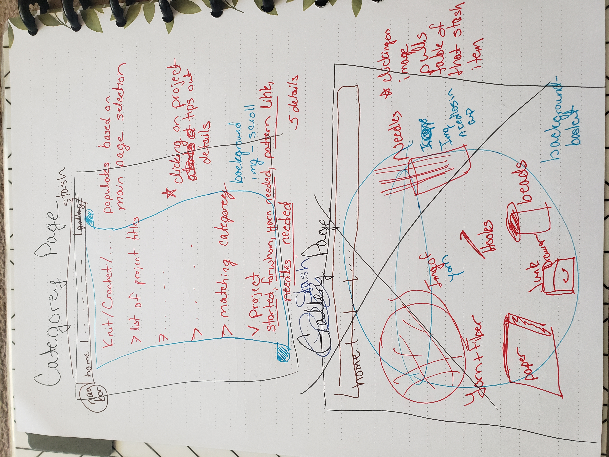
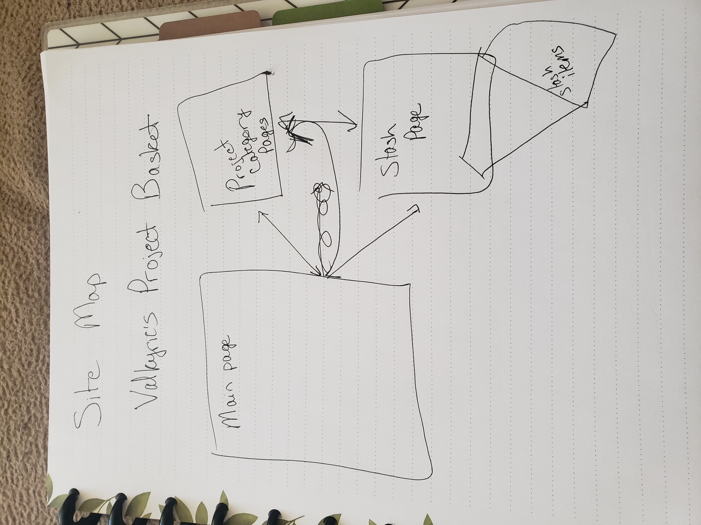

Valkyrie's Project Basket
========

This project would serve as a virtual basket for me to keep track of my projects.  I hand-make gifts for my family every year for Yule, and typically track those projects using an analog tracker.  This virtual basket would be easier to edit and update, as well as easy to access.  The main page would have containers that change size based on the number of projects in that container's categorey, and each categorey would populate a category page with a list of the project titles in that category. Each project title can be tipped open to reveal details about the project.  Each categorey's project list will look slightly different.

The other option from the main page would be to the Stash Page, where there are several containers for types of stash.  One for yarn, one for knitting needles, one for crochet hooks, etc.  Clicking on the container would bring up the table of that item, so clicking on the needles will bring up a list of my owned knitting needles and whether they are currently in a project or available to use.

Web Service
-------

[Ravelry API](https://www.ravelry.com/api)
- POST projects/crafts
- POST projects/create
- DELETE projects/delete
- GET projects/list
- POST project/project_statuses
- GET project/show
- POST project/update
- POST stash/create
- DELETE stash/delete
- GET stash/list
- GET stash/show
- POST stash/update

Database use
-------

I will need to read and write data regarding my projects, their status and required materials, and my stash items.  Projects will have fields such as the materials needed, the pattern link, who it is for, and if the project has been started.  Stash details will include details that are dependent on type of material.  My needles statsh would have type of needle, size of needle, and whether these needles are in use for a project right now.

Tables needed:
- projectDetails (will connect on craftCategory PK, have access to stash details for materials)
- craftCategory 
- stashCategory
- stashDetails (will connect on stashCategory PK)

Initial designs

